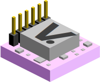
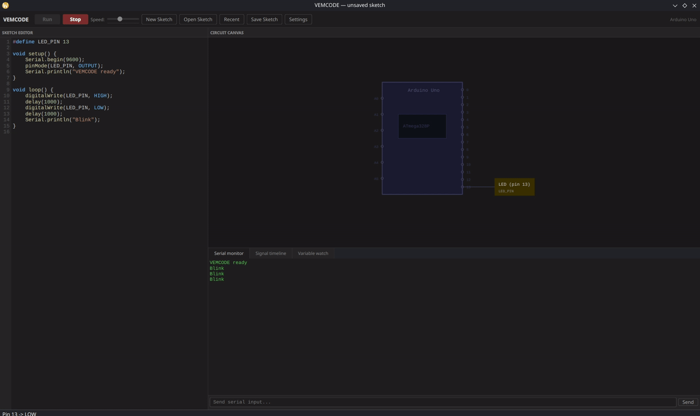

# VEMCODE 
### *Virtual Embedded Code Development Environment*

VEMCODE reads your sketch and automatically detects your components, builds the circuit, and simulates your firmware in real time. No hardware, no wiring, no setup needed.

<br clear="left">




## What is VEMCODE?

VEMCODE is an open-source firmware development and testing environment for embedded C++, not a circuit simulator. Write a sketch exactly as you would for a real board, hit Run, and watch it execute against a virtual Arduino or Teensy in real time. No board, no USB cable, no flash cycle, and no manual circuit design. VEMCODE reads your sketch and builds the circuit automatically!

The goal is to shorten the feedback loop between writing embedded code and observing its behavior. VEMCODE is built for developers who want to test firmware logic, validate algorithms, and debug serial output without waiting for hardware. It is also built for the developer who wants to test if hardware or software is causing the bugs, because VEMCODE can help see if the sketch is the problem or if its the circuit.

## Why VEMCODE?

Most embedded simulators focus on circuit design: component datasheets, voltage levels, electrical characteristics. VEMCODE focuses on the firmware layer, the C++ code you actually write and ship.

**VEMCODE is for you if:**
- You want to test firmware logic before (or without) physical hardware
- You need to test to see if firmware works if the hardware is having issues
- You need a serial monitor, signal timeline, or variable watch during development

**VEMCODE is not a circuit simulator.** It does not model voltage, current, or electrical behavior. If you need SPICE-level accuracy, tools like SimulIDE are better suited. VEMCODE's strength is rapid firmware testing and software validation without requiring physical boards.

## How it compares

| | VEMCODE | Wokwi | Velxio | SimulIDE | Renode |
|---|:---:|:---:|:---:|:---:|:---:|
| Open Source | ✓ | ✗ | ✓ | ✓ | ✓ |
| Desktop App | ✓ | Browser | Browser | ✓ | ✓ |
| Firmware Dev Focus | ✓ | Partial | ✓ | ✗ | ✓ |
| Circuit Simulation | ✗ | Partial | Partial | ✓ | ✗ |
| Arduino Support | ✓ | ✓ | ✓ | ✓ | ✗ |
| Teensy Support | ✓ | Partial | ✗ | ✗ | ✗ |
| Native Compilation | ✓ | ✗ | ✗ | ✗ | ✗ |
| No Account Required | ✓ | ✗ | ✓ | ✓ | ✓ |

> Wokwi also offers a VS Code extension and CLI. Velxio is self-hostable via Docker and supports ESP32 and Raspberry Pi boards. SimulIDE has strong circuit simulation depth. Renode targets complex ARM/RISC-V SoC firmware rather than Arduino-style sketches.

## What it does

Write embedded sketches directly in the built-in editor and simulate them instantly. VEMCODE compiles your sketch to a native shared library (`.dll` on Windows, `.so` on Linux) and runs it against a virtual runtime in real time.

- **Write Sketches** Syntax-highlighted editor with auto-indent, line numbers, and compile error highlighting
- **Simulate** Run your sketch, it compiles/processes, and then executes in milliseconds
- **Visualize** No circuit design step! it reads your sketch and builds the canvas automatically with components, layout, etc.
- **Interact** Click buttons, toggle switches, drag potentiometers, and type serial input to interact with the running simulation
- **Debug** serial monitor, signal timeline (logic analyzer view), and variable watch panel
- **Hot-reload** edit your sketch, hit Run again, simulation restarts instantly
- **Speed control** slow down or speed up simulation from 0.1x to 2.5x using included slider, changes live while sketch is running

## Demo


### Sketch demo:

The demo runs the LamboWallFollow sketch, an obstacle avoidance algorithm for a three-wheeled omni-directional robot navigating a maze of horizontal walls with gaps at random positions. 
```
Maze Shape (Left to right = Forward)
      _________________                _________________
      | o |       |   |                |   | -->   |   |
      | | |   |   |   |    ------->    |   | o |   |   |
      | >     |       |                |   --^ |       |
      |___|___|___|___exit             |___|___|___|____exit
```

### How it works:

The robot continuously tracks its lateral position in the corridor. When the ultrasonic sensor detects a wall ahead, the algorithm checks which half of the corridor the robot is in and immediately moves the opposite direction toward the potential gap. If the robot reaches the edge of the corridor without finding a gap, it flips direction to cover the full width as a fallback.

---

## Features

### Editor
The editor is a built-in IDE on the left side of the window in an adjustable panel. It includes syntax highlighting, line numbers, compile error handling, and keyboard shortcuts for a familiar embedded development experience.

#### Code Highlighter
Highlights keywords, Arduino functions, constants, numbers, strings, and comments. Compile errors are highlighted with a red background on the affected line.

#### Line Numbers
Adds line numbers to the left of each line of code for error tracking and debugging.

#### Keyboard Shortcuts
- Tab: inserts 4 spaces
- Enter: continues indentation from previous line, adds an extra indent after {.
- }: automatically dedents to match the opening {


### Circuit Canvas
The circuit canvas is a custom panel placed on the top right which will automatically draw the circuit based on detected components and place them for you. The outputs go to the right of the microcontroller and the inputs are on the left. Inputs are interactive and Sensors have input fields based on type.

#### Supported Components
- Outputs: LED, Buzzer, Servo, H-Bridge Motor, LCD, Generic Output
- Inputs: Button (clean and bouncy variants), Switch, Potentiometer
- Sensors: Color Sensor, Distance Sensor, Light Sensor (LDR), Temperature Sensor, Generic Analog Sensor

### Supported Libraries
VEMCODE does not support standard Arduino libraries directly. Instead, each supported library is a custom implementation injected at compile time by the preprocessor, replacing the original `#include`.

- **Servo** — `attach()`, `write()`, `read()`, `attached()`, `detach()`; angle tracked and displayed live on the canvas
- **LiquidCrystal** — `begin()`, `print()`, `println()`, `setCursor()`, `clear()`, `write()`, `createChar()`; text displayed on the canvas LCD component in real time
- **SoftwareSerial** — `begin()`, `print()`, `println()`, `available()`, `read()`, `peek()`, `write()`; output routed to the serial monitor prefixed with `[SW:RX_PIN]`
- **EEPROM** — `read()`, `write()`, `update()`; backed by a 1024-byte array in the runtime; does not persist between sessions
- **avr/wdt.h** — `wdt_enable()`, `wdt_disable()`, `wdt_reset()`; simulates watchdog timeout with a virtual reset if `wdt_reset()` is not called in time
- **avr/sleep.h** — `set_sleep_mode()`, `sleep_enable()`, `sleep_cpu()`, `sleep_disable()`; suspends the sketch thread until a watchdog timeout or interrupt fires

### Simulation
VEMCODE compiles your sketch to a native shared library and runs it directly on your machine. The C++ executes as compiled x86 code. The runtime implements the Arduino API through a function pointer table injected into your sketch at compile time. Calls like `digitalWrite()` or `analogRead()` route through the host, which updates the canvas and debug panels in realtime.

**Differences from real hardware:**
- Timing is not cycle accurate: millis and delay track wall clock time not AVR clock cycles.
- Floating INPUT pins return random values to simulate real world noise
- Button components simulate contact bounce by default (~10ms)
- EEPROM state does not persist between sessions

### Debug Panel
The debug panel includes the tabs serial monitor(s), signal timeline, and variable watch panel. It is located on the bottom right side and each of the tabs can be navigated independently.

#### Serial Monitor
Displays all `Serial.print()` and `Serial.println()` output from your sketch. Boards with multiple hardware serial ports (Mega, Due, Teensy 4.1) show a separate monitor for each port displayed side by side.

#### Signal Timeline
Displays a logic analyzer style view of digital pin activity. When a pin changes state it is automatically added to the timeline and shown as a scrollable square wave.

#### Variable Watch
Displays all variables that are tracked in the sketch and their current values in real time. The variables are added by adding this line of code to track it:
- `watch_variable("LABEL", value);`


---

## Getting started

### Prerequisites

**Windows:**
- Windows 10/11 64-bit
- Qt 6.x with MinGW 64-bit — [download from qt.io](https://www.qt.io/download)
  - During install select: Qt 6.x → MinGW 64-bit, and Developer Tools → Ninja
- CMake 3.20+

**Linux:**
- Qt 6 development packages (e.g. `qt6-qtbase-devel` on Fedora, `qt6-base-dev` on Ubuntu/Debian)
- CMake 3.20+
- g++ (GCC or Clang)

### Build from source

**Windows:**

```powershell
# Clone
git clone https://github.com/cole-stortz/VEMCODE.git
cd VEMCODE

# Configure (all one line)
cmake -B build -S . -G "Ninja" -DCMAKE_PREFIX_PATH="C:/Qt/6.11.1/mingw_64" -DCMAKE_CXX_COMPILER="C:/Qt/Tools/mingw1310_64/bin/g++.exe" -DCMAKE_MAKE_PROGRAM="C:/Qt/Tools/Ninja/ninja.exe"

# Build
cmake --build build

# Deploy Qt runtime (first time only)
C:\Qt\6.11.1\mingw_64\bin\windeployqt.exe app\VEMCODE.exe
```

> **Note:** Ninja may be at a different path depending on your system. Run `where.exe ninja` to find it.

**Linux:**

```bash
# Clone
git clone https://github.com/cole-stortz/VEMCODE.git
cd VEMCODE

# Configure
cmake -B build -S .

# Build
cmake --build build
```

### First run

**Windows:**
```powershell
.\app\VEMCODE.exe
```

**Linux:**
```bash
./app/VEMCODE
```

On first launch VEMCODE will ask for your compiler path and project root. Point it at your `g++` (e.g. `/usr/bin/g++` on Linux, `C:/Qt/Tools/mingw1310_64/bin/g++.exe` on Windows) and the root of the VEMCODE repo. These are saved to `app/settings.ini`.

---

## Writing sketches

VEMCODE accepts standard embedded C++ syntax, write exactly what you would write for a real board:

```cpp
#define LED_PIN    13
#define BUTTON_PIN  2

void setup() {
    Serial.begin(9600);
    pinMode(LED_PIN, OUTPUT);
    pinMode(BUTTON_PIN, INPUT_PULLUP);
    Serial.println("Ready");
}

void loop() {
    if (digitalRead(BUTTON_PIN) == LOW) {
        digitalWrite(LED_PIN, HIGH);
        Serial.println("Button pressed");
    } else {
        digitalWrite(LED_PIN, LOW);
    }
    delay(50);
}
```

The preprocessor automatically transforms your sketch into the VEMCODE runtime format. You never write any boilerplate.

See [SKETCH_GUIDE.md](docs/SKETCH_GUIDE.md) for more information on writing sketches.

---

## Architecture

VEMCODE compiles your sketch into a shared library (`.dll` on Windows, `.so` on Linux) using the system C++ compiler and loads it at runtime. The sketch calls back into the host through a function pointer table, so `digitalWrite(13, HIGH)` in your sketch calls `impl_digitalWrite` in the host, which updates the canvas and signal timeline in real time.

```
Your sketch (.cpp)
    → Preprocessor (transforms sketch syntax → shared library format)
    → g++ (compiles to .so / .dll)
    → SketchHost (dlopen/LoadLibrary, extracts vb_init/vb_setup/vb_loop)
    → SketchThread (runs vb_loop in background thread)
    → Runtime (implements all API calls, fires callbacks)
    → UI (canvas, serial monitor, signal timeline, variable watch)
```

Hot-reload works by watching the sketch file for changes and reloading the shared library while the simulation is running.

The board profile (selected in Settings or set through the sketch) drives pin count, analog mapping, PWM resolution, and the canvas graphic.

See [ARCHITECTURE.md](docs/ARCHITECTURE.md) for more information about how VEMCODE actually works.

### Project structure

```
VEMCODE/
├── app/                        # Runtime — exe + Qt DLLs
│   ├── sketches/               # Saved sketches
│   └── settings.ini            # Compiler path + recent sketches (gitignored)
├── src/
│   ├── main.cpp
│   ├── ui/
│   │   ├── mainwindow.cpp/h    # Main window, toolbar, all UI wiring
│   │   ├── canvaswidget.cpp/h  # Circuit canvas + component rendering
│   │   ├── signaltimeline.cpp/h
│   │   ├── codehighlighter.cpp/h
│   │   ├── linenumberarea.cpp/h
│   │   ├── variablewatch.cpp/h
│   │   └── settingsdialog.cpp/h
│   └── core/
│       ├── runtime/
│       │   ├── arduinoapi.h        # API function pointer struct
│       │   ├── boardprofile.h      # Board profiles (pin count, analog map, language)
│       │   └── arduinoruntime.cpp/h
│       ├── host/
│       │   ├── sketchhost.cpp/h        # DLL load/unload + hot-reload
│       │   └── sketchhostthread.cpp/h  # Background simulation thread
│       ├── build/
│       │   ├── compiler.cpp/h      # Invokes g++
│       │   └── preprocessor.cpp/h  # Sketch → VEMCODE transform
│       └── circuit/
│           └── circuitdetector.cpp/h   # Auto component detection
├── sketches/                   # Example sketches
└── CMakeLists.txt
```

---

## Project Status

VEMCODE is currently in **Alpha**. Core functionality is operational, but bugs, incomplete features, and breaking changes should be expected.

### Known limitations
- Real electrical behavior (voltage, current, short circuits) — not in scope; VEMCODE simulates firmware logic, not analog electronics; use SimulIDE or LTspice for SPICE-level modeling
- Hardware bridge features operate at a data layer only (planned). Physical devices can exchage data with the simulator, but electrical characteristics and wiring behavior are outside scope.

See [ROADMAP.md](docs/ROADMAP.md) for planned features and future direction.

---

## Contributing

Contributions are welcome. VEMCODE is in early development, so feedback on rough edges, missing API calls, or unintuitive behavior is just as valuable as code contributions.

- **Bug reports** — open an issue describing what happened and how to reproduce it
- **Feature requests** — check [ROADMAP.md](docs/ROADMAP.md) first to see if it's already planned, then open an issue to discuss before submitting a PR
- **Code contributions** — fork the repo, make your changes on a branch, and open a pull request; keep changes focused (one feature or fix per PR)

## License

VEMCODE is licensed under the [GNU General Public License v3.0](LICENSE).

You are free to use, modify, and distribute this software under the terms of the GPL v3 — including for free and open source projects.

**Commercial licensing:** If you want to use VEMCODE in a closed-source or commercial product without GPL obligations, contact me at cdstortz@gmail.com to arrange a commercial license.
