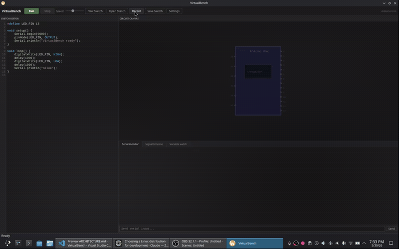

# VirtualBench

An open-source embedded systems simulator for writing, simulating, testing, and debugging embedded code — no hardware required. Supports Arduino and Teensy boards today, with MicroPython and CircuitPython boards on the roadmap.


## What it does

Write embedded sketches directly in the built-in editor and simulate them instantly — no board, no USB cable, no waiting. VirtualBench compiles your sketch to a native shared library (`.dll` on Windows, `.so` on Linux) and runs it against a virtual runtime in real time.

- **Write** embedded code in a syntax-highlighted editor with auto-indent, line numbers, and compile error highlighting
- **Simulate** instantly — hit Run and your sketch compiles and executes in milliseconds
- **Visualize** — the circuit canvas auto-detects components from your code and renders them automatically
- **Interact** — click buttons, toggle switches, drag potentiometers, and type serial input to interact with the running simulation
- **Debug** — serial monitor, signal timeline (logic analyzer view), and variable watch panel
- **Hot-reload** — edit your sketch, hit Run again, simulation restarts instantly
- **Speed control** — slow down or speed up simulation from 0.1x to 2.5x

## Demo



The demo runs the LamboWallFollow sketch, an obstacle avoidance algorithm for a three-wheeled omni-directional robot navigating a maze of horizontal walls with gaps at random positions. The robot continuously tracks its lateral position in the corridor. When the ultrasonic sensor detects a wall ahead, the algorithm checks which half of the corridor the robot is in and immediately moves the opposite direction toward the potential gap. Using this approach allows us to most likely approach the gap. If the robot reaches the edge of the corridor without finding a gap, it flips direction to cover the full width as a fallback. Once past the wall it drives forward again and repeats. A color sensor on the underside detects a green marker on the floor as the finish line, or the simulation ends when a maximum forward distance is reached.

---

## Features

### Editor
- Syntax highlighting (keywords, functions, strings, comments)
- Line numbers
- Auto-indent — Enter after `{` indents automatically
- Auto-dedent — typing `}` on an indented blank line dedents automatically
- Tab = 4 spaces
- Compile error highlighting — error lines turn red with tooltip showing the message
- Ctrl+S to save
- New sketch, Open, Save, Recent sketches (last 5)

### Simulation
- Full API support:
  - `pinMode`, `digitalWrite`, `digitalRead`
  - `analogWrite`, `analogRead`
  - `delay`, `delayMicroseconds`, `millis`, `micros`
  - `pulseIn(pin, value, timeout)` — fast path for sensors, color channel routing for TCS3200, pin polling fallback
  - `Serial.begin`, `Serial.print`, `Serial.println`, `Serial.available`, `Serial.read`
  - `tone`, `noTone`
  - `map`, `constrain`, `abs`, `min`, `max`, `random`
- Full `String` class — construction, concatenation, search, manipulation, conversion
- Speed slider — 0.1x to 2.5x simulation speed
- Stop is instant — no waiting for long delays to finish

### Circuit Canvas
Auto-detects components from `#define` names and `pinMode` / `analogRead` calls:

| Component | Detection keywords | Interaction |
|---|---|---|
| LED | LED, LIGHT, LAMP, INDICATOR | Visual on/off |
| Button | BTN, BUTTON, KEY | Click to press |
| Switch | SWITCH, SW, TOGGLE | Click to toggle |
| Buzzer | BUZZER, BUZZ, SPEAKER, TONE, PIEZO | Visual active state |
| Servo | SERVO, SRV | Live angle display (0-180°) |
| H-bridge motor | MOTOR, CW, CWISE, ANTI, IN1, IN2 | Visual active state |
| Distance sensor | TRIG, ECHO (pair) | Type distance in cm — pulseIn returns matching µs |
| Color sensor | S0, S1, S2, S3, COLOR_OUT (array) | Type R/G/B values (0-255) |
| Potentiometer | POT, POTENTIOMETER, DIAL | Drag to set value 0-1023 |
| Light sensor | PHOTO, LDR, PHOTORESISTOR | Type analog value (0-1023) |
| Temperature sensor | TEMP, TEMPERATURE, THERMISTOR | Type analog value (0-1023) |
| Analog sensor | SENSOR, ANALOG, ADC | Type analog value (0-1023) |
| LCD / OLED | LCD, DISPLAY, SCREEN, OLED | Character rendering |

> Board profile (pin count, analog mapping, PWM resolution) is set in Settings. Supported boards: Arduino Uno, Nano, Mega 2560, Due, Teensy 4.1. The selected board drives pin count, analog offset, PWM resolution, and the canvas board graphic.

### Debug Panel
- **Serial monitor** — live `Serial.print` output, plus a text input box to send data to `Serial.read`
- **Signal timeline** — logic analyzer view of all pin state changes over time
- **Variable watch** — live table of `watch_variable("name", value)` calls from your sketch

---

## Getting started

### Prerequisites

**Windows:**
- Windows 10/11 64-bit
- Qt 6.x with MinGW 64-bit — [download from qt.io](https://www.qt.io/download)
  - During install select: Qt 6.x → MinGW 64-bit, and Developer Tools → Ninja
- CMake 3.20+

**Linux:**
- Qt 6 development packages (e.g. `qt6-qtbase-devel` on Fedora, `qt6-base-dev` on Ubuntu/Debian)
- CMake 3.20+
- g++ (GCC or Clang)

### Build from source

**Windows:**

```powershell
# Clone
git clone https://github.com/cole-stortz/VirtualBench.git
cd VirtualBench

# Configure (all one line)
cmake -B build -S . -G "Ninja" -DCMAKE_PREFIX_PATH="C:/Qt/6.11.1/mingw_64" -DCMAKE_CXX_COMPILER="C:/Qt/Tools/mingw1310_64/bin/g++.exe" -DCMAKE_MAKE_PROGRAM="C:/Qt/Tools/Ninja/ninja.exe"

# Build
cmake --build build

# Deploy Qt runtime (first time only)
C:\Qt\6.11.1\mingw_64\bin\windeployqt.exe app\VirtualBench.exe
```

> **Note:** Ninja may be at a different path depending on your system. Run `where.exe ninja` to find it.

**Linux:**

```bash
# Clone
git clone https://github.com/cole-stortz/VirtualBench.git
cd VirtualBench

# Configure
cmake -B build -S .

# Build
cmake --build build
```

### First run

**Windows:**
```powershell
.\app\VirtualBench.exe
```

**Linux:**
```bash
./app/VirtualBench
```

On first launch VirtualBench will ask for your compiler path and project root. Point it at your `g++` (e.g. `/usr/bin/g++` on Linux, `C:/Qt/Tools/mingw1310_64/bin/g++.exe` on Windows) and the root of the VirtualBench repo. These are saved to `app/settings.ini`.

---

## Writing sketches

VirtualBench accepts standard embedded C++ syntax — write exactly what you would write for a real board:

```cpp
#define LED_PIN    13
#define BUTTON_PIN  2

void setup() {
    Serial.begin(9600);
    pinMode(LED_PIN, OUTPUT);
    pinMode(BUTTON_PIN, INPUT_PULLUP);
    Serial.println("Ready");
}

void loop() {
    if (digitalRead(BUTTON_PIN) == LOW) {
        digitalWrite(LED_PIN, HIGH);
        Serial.println("Button pressed");
    } else {
        digitalWrite(LED_PIN, LOW);
    }
    delay(50);
}
```

The preprocessor automatically transforms your sketch into the VirtualBench runtime format. You never write any boilerplate.

### String support

The full `String` class is available:

```cpp
String msg = String("Count: ") + String(counter);
Serial.println(msg);
```

### Variable watch

Use `watch_variable` to monitor values in real time in the Variable Watch panel:

```cpp
watch_variable("counter", counter);
watch_variable("sensor", analogRead(A0));
```

### Serial input

Type into the serial monitor input box and hit Send (or Enter) to inject data into `Serial.available()` / `Serial.read()`:

```cpp
if (Serial.available() > 0) {
    int c = Serial.read();
    Serial.println(c);
}
```

### Non-blocking patterns

`millis()` works correctly for non-blocking timing:

```cpp
unsigned long last = 0;

void loop() {
    if (millis() - last >= 500) {
        last = millis();
        digitalWrite(LED_PIN, !digitalRead(LED_PIN));
    }
}
```

---

## Architecture

VirtualBench compiles your sketch into a shared library (`.dll` on Windows, `.so` on Linux) using the system C++ compiler and loads it at runtime. The sketch calls back into the host through a function pointer table — so `digitalWrite(13, HIGH)` in your sketch calls `impl_digitalWrite` in the host, which updates the canvas and signal timeline in real time.

```
Your sketch (.cpp)
    → Preprocessor (transforms sketch syntax → shared library format)
    → g++ (compiles to .so / .dll)
    → SketchHost (dlopen/LoadLibrary, extracts vb_init/vb_setup/vb_loop)
    → SketchThread (runs vb_loop in background thread)
    → Runtime (implements all API calls, fires callbacks)
    → UI (canvas, serial monitor, signal timeline, variable watch)
```

Hot-reload works by watching the sketch file for changes and reloading the shared library while the simulation is running.

The board profile (selected in Settings) drives pin count, analog mapping, PWM resolution, and the canvas graphic. Adding a new board is a matter of adding a new `BoardProfile` entry — the rest of the simulation is board-agnostic.

### Project structure

```
VirtualBench/
├── app/                        # Runtime — exe + Qt DLLs
│   ├── sketches/               # Saved sketches
│   └── settings.ini            # Compiler path + recent sketches (gitignored)
├── src/
│   ├── main.cpp
│   ├── ui/
│   │   ├── mainwindow.cpp/h    # Main window, toolbar, all UI wiring
│   │   ├── canvaswidget.cpp/h  # Circuit canvas + component rendering
│   │   ├── signaltimeline.cpp/h
│   │   ├── codehighlighter.cpp/h
│   │   ├── linenumberarea.cpp/h
│   │   ├── variablewatch.cpp/h
│   │   └── settingsdialog.cpp/h
│   └── core/
│       ├── runtime/
│       │   ├── arduinoapi.h        # API function pointer struct
│       │   ├── boardprofile.h      # Board profiles (pin count, analog map, language)
│       │   └── arduinoruntime.cpp/h
│       ├── host/
│       │   ├── sketchhost.cpp/h        # DLL load/unload + hot-reload
│       │   └── sketchhostthread.cpp/h  # Background simulation thread
│       ├── build/
│       │   ├── compiler.cpp/h      # Invokes g++
│       │   └── preprocessor.cpp/h  # Sketch → VirtualBench transform
│       └── circuit/
│           └── circuitdetector.cpp/h   # Auto component detection
├── sketches/                   # Example sketches
└── CMakeLists.txt
```

---

### Known limitations

- AVR assembly instructions and hardware interrupt vectors (`ISR()`) — require a full CPU emulator, incompatible with the compile-to-native approach
- Real electrical behavior (voltage, current, short circuits) — not simulatable without SPICE-level modeling

---

## License

VirtualBench is licensed under the [GNU General Public License v3.0](LICENSE).

You are free to use, modify, and distribute this software under the terms of the GPL v3 — including for free and open source projects.

**Commercial licensing:** If you want to use VirtualBench in a closed-source or commercial product without GPL obligations, contact me at cdstortz@gmail.com to arrange a commercial license.

## Contributing

Pull requests welcome. If you find a bug or want a feature, open an issue.